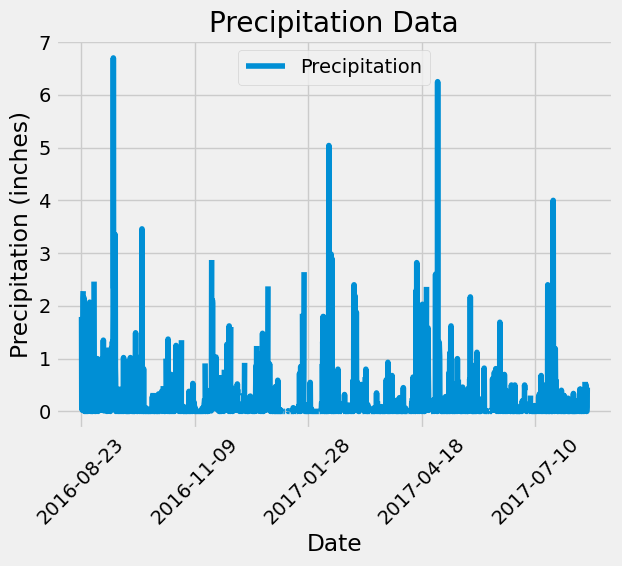
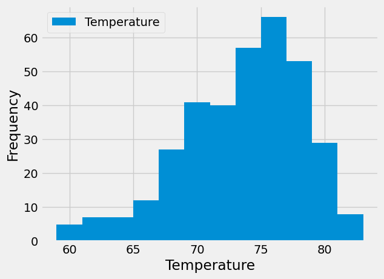

# sqlalchemy-challenge
**Module 10 challenge**

This challenge is divided into two parts:
 
Analyze and Explore the Climate Data

Design Your Climate App

# Analyze and Explore the Climate Data

In this section, Python and SQLAlchemy has been used to do  climate analysis and data exploration of climate database. Mainly, we use SQLAlchemy ORM queries, Pandas, and Matplotlib. To achieve our task,we completed the following steps:

we use the provided files (climate_starter.ipynb and hawaii.sqlite) to complete climate analysis and data exploration.

SQLAlchemy create_engine() function has been used to connect to the SQLite database.

SQLAlchemy automap_base() function has been used to reflect  tables into classes, and then to save references to the classes named station and measurement.

Python has been linked to the database by creating a SQLAlchemy session.

Analysis of climate data is divide into two stages:

**Precipitation Analysis**

Firstly the most recent date in the dataset has been calculated by using session.query. Using that date, we get the previous 12 months of precipitation data by using .filter.
Once the data is retrieved , it has been stored into a pandas data frame and Plotted using Pandas plotting.
Using pandas Describe() function, a summary statictics for Precipitation data also showed.

**Exploratory Station Analysis**

 Secondly, station data has been used to display the total number of stations in the data set.
Finding the most active station through a query which counts the rows for each station, lists the stations and observation counts in descending order and displays the station with the greatest number of observations.
Querying the data to find the lowest, highest and average temperatures for the most active station.
Finally, Plotting the results as a histogram with 12 bins which creates the following chart:

# Part 2: Design the Climate App

This section of the challenge comprises of  a Flask API based on the queries and analysis peformed in Part 1. The following routes are created using Flask:

/

This is the homepage and lists all available API routes.

/api/v1.0/precipitation

This route performs a query and returns Jsonified dictionary of the precipitation data for the last 12 months using 'date' as the key and 'prcp' as the value.

/api/v1.0/stations

This route performs a query and returns a JSON list of all stations along their names from the dataset.

/api/v1.0/tobs

This route performs a query and returns a JSON list of dictionary containing dates and temperature values of the most active station (USC00519281) for the previous year.

/api/v1.0/<start>

This route performs a query and returns a Jsonified list of dictionary containing date, min temperature, max temperature and average temperature data for all the dates greater than or equal to the start date. The start date is expected in the formart YYYY-MM-DD as a parameter for the URL.

/api/v1.0/<start>/<end>

This route performs a query and returns a JSON list of dictionary displaying date, minimum temperature, maximum temperature and average temperature data for all the dates from the start date to the end date, inclusive. The start date and end date are acceptable in the formart YYYY-MM-DD/YYYY-MM-DD as parameters from the URL.
This climate api has the data for the date range 2010-01-01 to 2017-08-23.